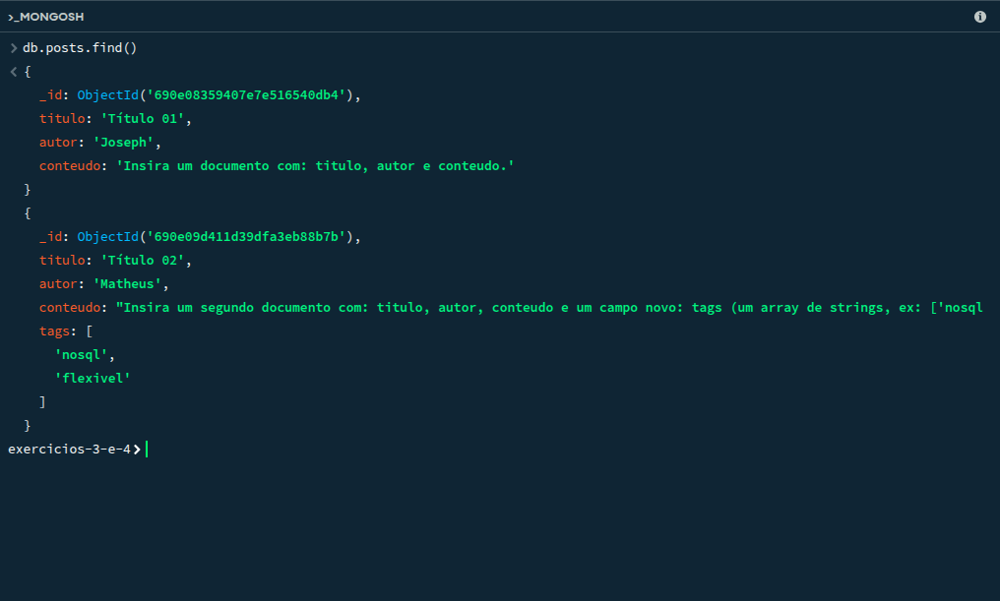
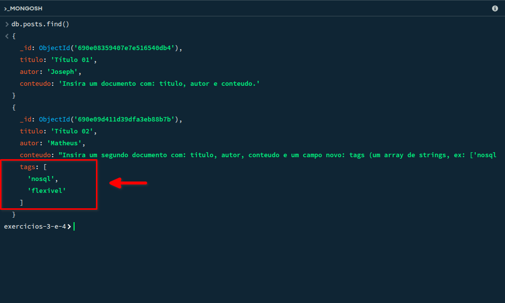
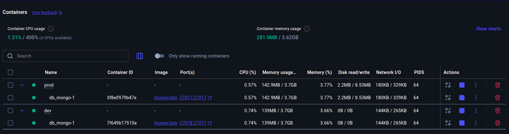

# Exercícios NoSQL

## ⚙️ Exercício 3 — Não relacional (CRUD Básico)

### Objetivo

Aprender a estrutura básica de um banco NoSQL (MongoDB) e entender o conceito de
"Schema Flexível".

### Descrição

Crie uma coleção (equivalente a uma "tabela") para os posts de um blog. Você irá inserir
documentos (equivalente a "linhas") com estruturas diferentes para provar a flexibilidade.

1. **Criar uma coleção:**
    - Nomeie a coleção como posts.

2. **Inserir (Create):**
    - Insira um documento com: titulo, autor e conteudo.

3. **Testar Schema Flexível:**
    - Insira um segundo documento com: titulo, autor, conteudo e um campo novo:
tags (um array de strings, ex: ["nosql", "flexivel"]).

4. **Consultar (Read):**
    - Use o comando find() para listar todos os documentos da coleção posts.

### Critérios de sucesso

- find() retorna os dois documentos.

    

- O segundo documento possui o campo tags e o primeiro não, provando que o banco
aceitou estruturas diferentes na mesma coleção.

    

___

## ⚙️ Exercício 4 — Não relacional (Consultas Avançadas)

### Objetivo

Aprender a consultar (filtrar) dados com base em campos específicos, arrays e documentos
aninhados.

### Descrição

Usando a coleção posts do Exercício 3, você vai adicionar dados mais complexos
(comentários) e aprender a filtrar os posts com base nesses novos dados.

1. **Atualizar (Update):**
    - Use updateOne() para adicionar um campo comentarios em um dos seus posts.
    - comentarios deve ser um array de documentos.

2. **Criar dois arquivos Compose:**
    - [docker-compose.dev.yml](docker-compose.dev.yml) — monta volume local, expõe portas, usa Dockerfile de dev.
    - [docker-compose.prod.yml](docker-compose.prod.yml) — usa imagem final otimizada, sem montar volumes.

3. **Testar ambos os ambientes:**
    - Escreva uma consulta find() que retorne apenas posts com a tag "nosql" (consultando dentro de um array).
    - Escreva uma consulta find() que retorne apenas posts onde o autor seja um nome específico.
    - docker compose -f docker-compose.prod.yml up

### Critérios de sucesso

- Ambientes dev/prod funcionam de forma independente.

    

- O build final segue boas práticas (camadas otimizadas, .dockerignore, imagem leve).
- Estrutura organizada e reutilizável.

___
