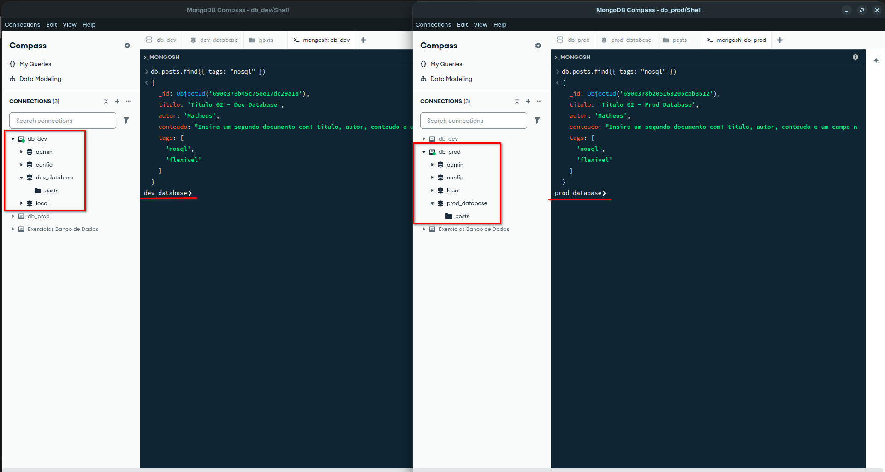
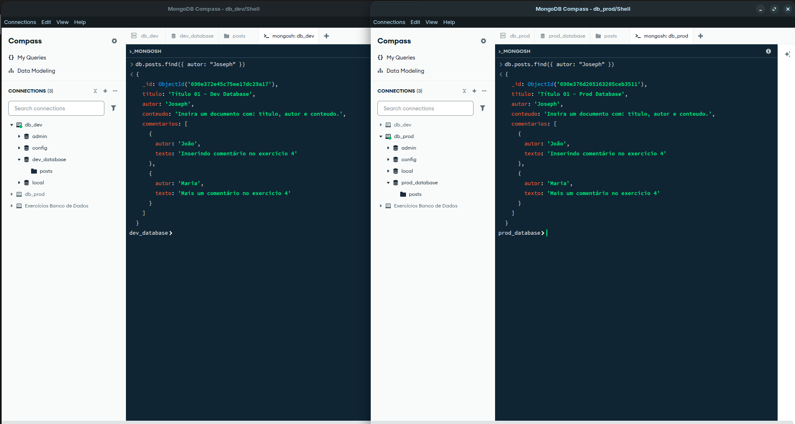

# Exercicio 4 - Resolução

Usando a coleção posts do Exercício 3, você vai adicionar dados mais complexos
(comentários) e aprender a filtrar os posts com base nesses novos dados.

1. **Atualizar (Update):**
    - Use updateOne() para adicionar um campo comentarios em um dos seus posts.
    - comentarios deve ser um array de documentos.

      ```mongosh
      db.posts.updateOne(
        { _id: ObjectId("690e2aee35adfa89cdef4104") },
        {
          $set: {
            comentarios: [
              { autor: "João", texto: "Inserindo comentário no exercicio 4" },
              { autor: "Maria", texto: "Mais um comentário no exercicio 4" }
            ]
          }
        }
      )
      ```

2. **Criar dois arquivos Compose:**
    - [docker-compose.dev.yml](docker-compose.dev.yml) — monta volume local, expõe portas, usa Dockerfile de dev.
    - [docker-compose.prod.yml](docker-compose.prod.yml) — usa imagem final otimizada, sem montar volumes.

3. **Testar ambos os ambientes:**
    - Escreva uma consulta find() que retorne apenas posts com a tag "nosql" (consultando dentro de um array).

      ```mongosh
      db.posts.find({ tags: "nosql" })
      ```

      
  
    - Escreva uma consulta find() que retorne apenas posts onde o autor seja um nome específico.

      ```mongosh
      db.posts.find({ autor: "Joseph" })
      ```

      

    - docker compose -f docker-compose.prod.yml up
