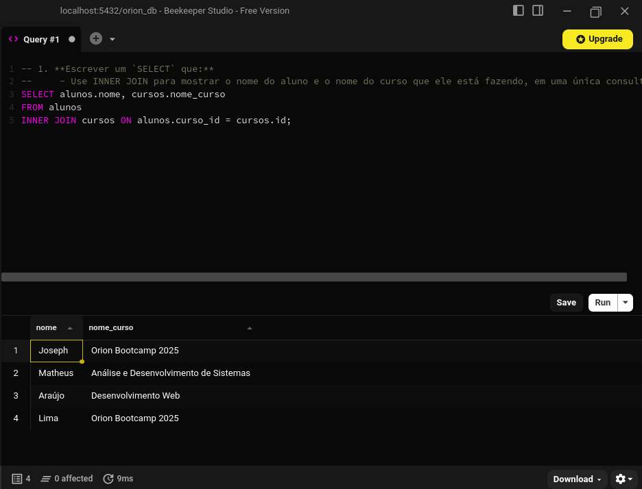
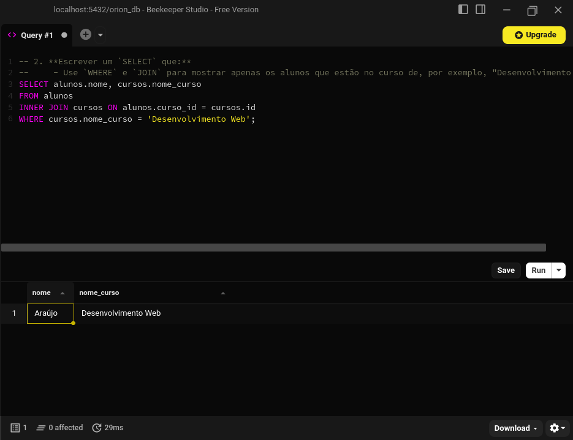
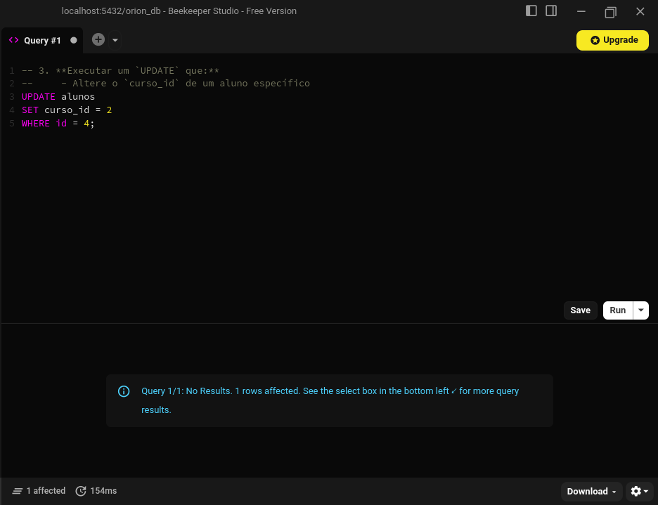
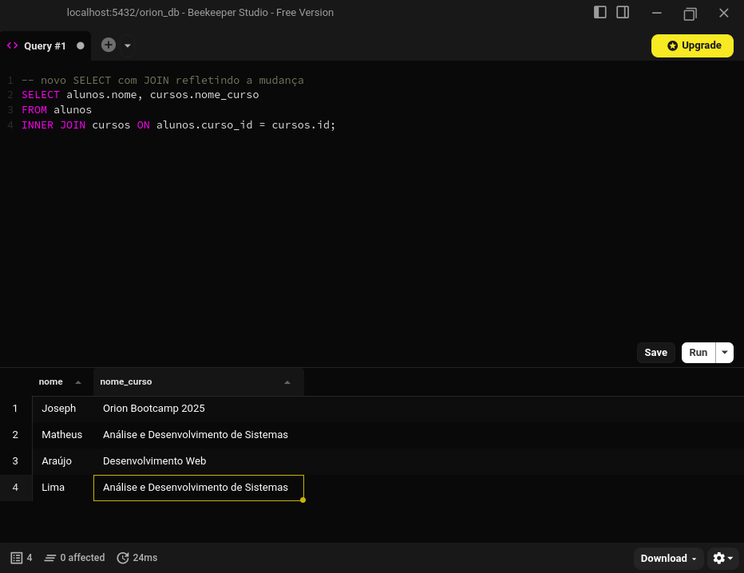

# Exercícios SQL

## 🧱 Exercício 1 — Banco relacional (SQL Básico)

### Objetivo

Aprender os comandos básicos de SQL para Definição (CREATE TABLE) e Manipulação
(INSERT, SELECT).

### Descrição

Você criará as tabelas, definirá suas colunas e chaves, e inserirá alguns dados de teste.

1. **Criar a tabela cursos que:**
    - Tenha as colunas:
        - `id` (Chave Primária, numérico)
        - `nome_curso` (Texto).

2. **Criar a tabela alunos que:**
    - Tenha as colunas:
        - `id` (Chave Primária)
        - `nome` (Texto)
        - `email` (Texto)
        - `curso_id` (numérico).

    - Configure `curso_id` como uma Chave Estrangeira (FK) que se relaciona com o `id` da tabela cursos.

3. **Inserir dados**
    - Insira 2-3 cursos na tabela cursos.
    - Insira 3-4 alunos na tabela alunos, relacionando-os com os cursos que você criou.

### Critérios de sucesso

- O comando `CREATE TABLE` executa sem erros.

    

- A Chave Estrangeira impede que você insira um aluno com um `curso_id` que não existe.

    

- O comando `SELECT * FROM alunos`; retorna todos os alunos que você inseriu.

    

---

## 🗃️ Exercício 2 — Banco relacional (JOINs e Filtros)

### Objetivo

Aprender a consultar dados de múltiplas tabelas usando `JOIN` e a filtrar resultados com `WHERE`.

### Descrição

Usando o esquema e os dados do Exercício 1, você agora vai responder perguntas complexas que exigem a combinação de dados das tabelas alunos e cursos.

1. **Escrever um `SELECT` que:**
    - Use `INNER JOIN` para mostrar o nome do aluno e o nome do curso que ele está fazendo, em uma única consulta.

2. **Escrever um `SELECT` que:**
    - Use `WHERE` e `JOIN` para mostrar apenas os alunos que estão no curso de, por exemplo, "Desenvolvimento Web".

3. **Executar um `UPDATE` que:**
    - Altere o `curso_id` de um aluno específico

### Critérios de sucesso

- A consulta `JOIN` retorna os nomes corretos.

    

- A consulta com `WHERE` filtra corretamente os alunos.

    

- O `UPDATE` é bem sucedido e um novo `SELECT` com `JOIN` reflete a mudança.

    

    

#### Extras (avançado)

- Escreva um `SELECT` com `LEFT JOIN` e `WHERE` para descobrir quais cursos não possuem nenhum aluno matriculado.

    > Todos os alunos estavam matriculados em algum curso no exercício 1.

---
