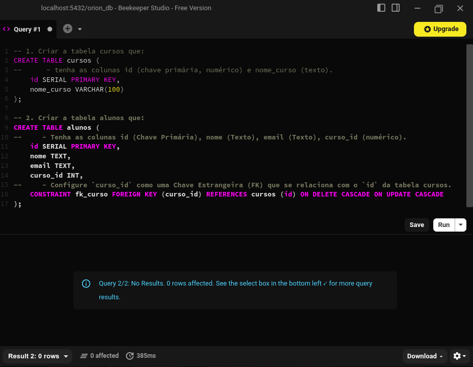
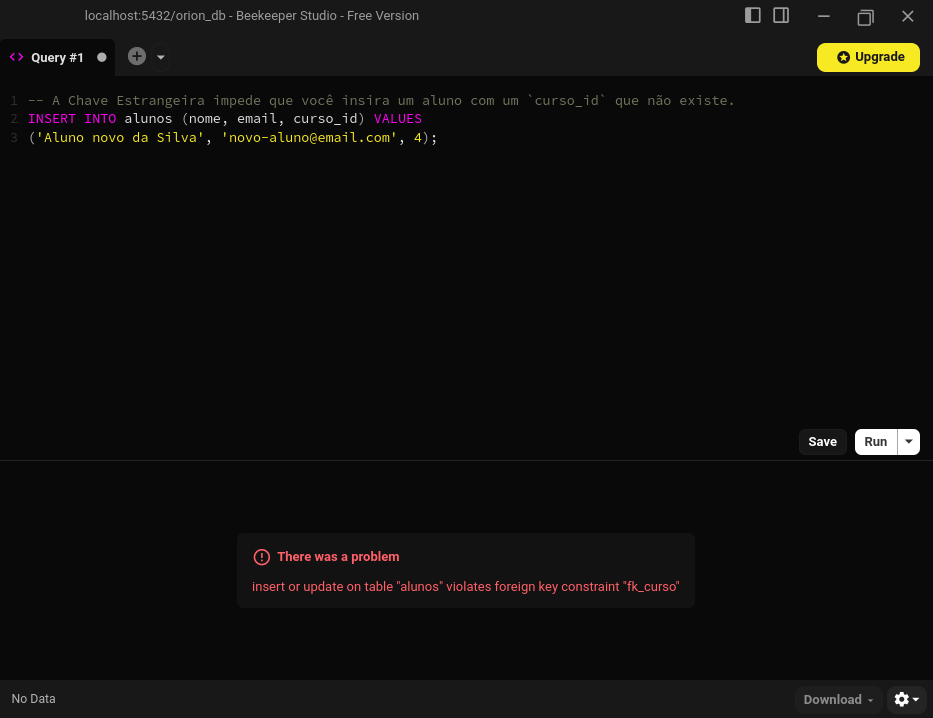
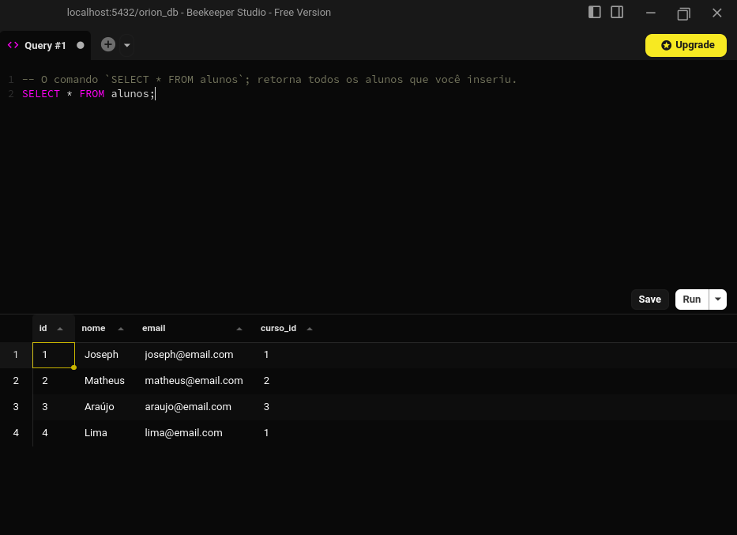

# Exercícios SQL

## 🧱 Exercício 1 — Banco relacional (SQL Básico)

### Objetivo

Aprender os comandos básicos de SQL para Definição (CREATE TABLE) e Manipulação
(INSERT, SELECT).

### Descrição

Você criará as tabelas, definirá suas colunas e chaves, e inserirá alguns dados de teste.

1. **Criar a tabela cursos que:**
    - Tenha as colunas:
        - `id` (Chave Primária, numérico)
        - `nome_curso` (Texto).

2. **Criar a tabela alunos que:**
    - Tenha as colunas:
        - `id` (Chave Primária)
        - `nome` (Texto)
        - `email` (Texto)
        - `curso_id` (numérico).

    - Configure `curso_id` como uma Chave Estrangeira (FK) que se relaciona com o `id` da tabela cursos.

3. **Inserir dados**
    - Insira 2-3 cursos na tabela cursos.
    - Insira 3-4 alunos na tabela alunos, relacionando-os com os cursos que você criou.

### Critérios de sucesso

- O comando `CREATE TABLE` executa sem erros.

    

- A Chave Estrangeira impede que você insira um aluno com um `curso_id` que não existe.

    

- O comando `SELECT * FROM alunos`; retorna todos os alunos que você inseriu.

    

---
