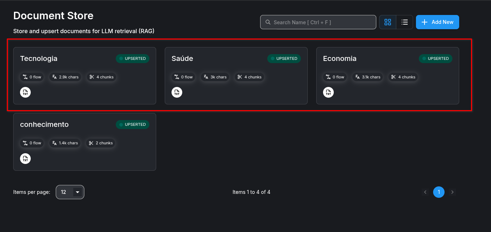

# Exercício 1 — Document Stores (Qdrant)

## Objetivo

Criar três bases vetoriais separadas, uma para cada agente especializado.

### 1. Crie três Document Stores

- Economia
- Saúde
- Tecnologia

### 2. Carregue os documentos relevantes em cada base

- Permitido usar qualquer documento desde que seja do tema

## Entrega *(Subir em uma pasta do Google Drive)*

- Prints dos três Document Stores

    

- Documentos utilizados
  - [economia.txt](economia.txt)
  - [saude.txt](saude.txt)
  - [tecnologia.txt](tecnologia.txt)
